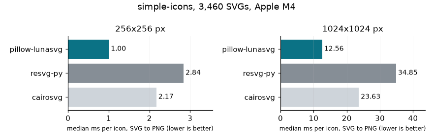
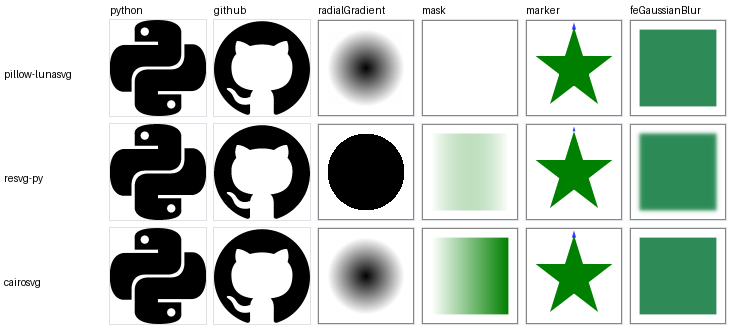

# pillow-lunasvg benchmark

Date: 2026-09-17. Machine: Apple M4, macOS 26.5.1, Python 3.13.15.

Versions: pillow-lunasvg 0.1.0 built locally from commit 653c187 (LunaSVG 3.5.0), Pillow 12.3.0, resvg-py 0.5.0, cairosvg 2.9.1 (cairocffi 1.7.1, cairo 1.18.4 from Homebrew).

Corpora (downloaded at run time, not vendored):
- simple-icons 16.31.0 (commit a538b54a37be7ab07420198de7a9f9985e2a4528), CC0: 3460 icons from `icons/`, all 24x24 viewBox, mostly one `<path>` each.
- resvg v0.48.1 (commit 68b14c4c3bccdb60344c777406486b54c36ec1a4), MIT/Apache-2.0: 1341 feature tests from `crates/resvg/tests/tests/`, every category except `text/` (fonts differ between renderers). Small (mostly 200x200) files that each exercise one SVG feature, including edge cases and filters. `filters/feMorphology/huge-radius.svg` is left out: resvg-py needs 1,095 s for it at 1024 px (one run).

## Speed: SVG bytes to PNG bytes

Longest side scaled to N px. Each file timed as the min of 3 runs, renderers interleaved per file. pillow-lunasvg = `Image.open` + `load(scale=)` + `save(PNG)` with Pillow's default zlib level; resvg-py = `svg_to_bytes(width=, height=, skip_system_fonts=True)`; cairosvg = `svg2png(output_width=, output_height=)`. The render-only row is pillow-lunasvg without the PNG encode (RGBA pixels in memory), which is what a thumbnail pipeline that re-encodes to WebP/JPEG pays. Files a renderer rejected are left out of its numbers. `filters/` tests are not timed: only resvg implements filters, so its time there is real work the other two skip (several feMorphology tests take 1-45 s each in resvg-py at 1024 px).

| corpus | px | renderer | median ms/file | total s | files |
|---|---|---|---|---|---|
| simple-icons | 256 | pillow-lunasvg | 1.00 | 3.35 | 3460 |
| simple-icons | 256 | resvg-py | 2.84 | 9.66 | 3460 |
| simple-icons | 256 | cairosvg | 2.17 | 7.89 | 3460 |
| simple-icons | 256 | pillow-lunasvg, render only | 0.11 | 0.43 | 3460 |
| simple-icons | 1024 | pillow-lunasvg | 12.56 | 39.99 | 3460 |
| simple-icons | 1024 | resvg-py | 34.85 | 112.04 | 3460 |
| simple-icons | 1024 | cairosvg | 23.63 | 82.40 | 3460 |
| simple-icons | 1024 | pillow-lunasvg, render only | 0.88 | 3.36 | 3460 |
| resvg tests | 256 | pillow-lunasvg | 0.45 | 0.55 | 943 |
| resvg tests | 256 | resvg-py | 2.17 | 2.52 | 941 |
| resvg tests | 256 | cairosvg | 1.47 | 1.46 | 884 |
| resvg tests | 256 | pillow-lunasvg, render only | 0.09 | 0.09 | 943 |
| resvg tests | 1024 | pillow-lunasvg | 5.26 | 6.51 | 943 |
| resvg tests | 1024 | resvg-py | 27.22 | 31.81 | 941 |
| resvg tests | 1024 | cairosvg | 19.16 | 18.14 | 884 |
| resvg tests | 1024 | pillow-lunasvg, render only | 0.78 | 0.91 | 943 |

## Fidelity against resvg (256 px)

Both images are compared as premultiplied RGBA (so the colour of fully transparent pixels does not count). A pixel differs if any channel differs by more than the tolerance; a file matches if at most 1% of its pixels differ. Strict tolerance = 26/255, loose = 64/255. The strict one also counts anti-aliasing differences: every resvg test has a 1 px frame stroke, and a few levels of alpha difference along it are enough to fail a file. resvg is the reference because it has the most complete SVG support of the three, not because it is always right.

| corpus | renderer | matching, strict | matching, loose | not comparable |
|---|---|---|---|---|
| simple-icons | pillow-lunasvg | 3426/3460 (99.0%) | 3456/3460 (99.9%) | 0 |
| simple-icons | cairosvg | 3440/3460 (99.4%) | 3460/3460 (100.0%) | 0 |
| resvg tests | pillow-lunasvg | 723/1341 (53.9%) | 791/1341 (59.0%) | 4 |
| resvg tests | cairosvg | 46/1341 (3.4%) | 708/1341 (52.8%) | 64 |

Not comparable = one of the two renderers raised an error or produced a different pixel size.

resvg tests by category (strict / loose):

| category | pillow-lunasvg | cairosvg |
|---|---|---|
| filters | 17% / 21% of 397 | 0% / 22% of 397 |
| masking | 73% / 94% of 93 | 2% / 44% of 93 |
| paint-servers | 73% / 75% of 151 | 1% / 70% of 151 |
| painting | 67% / 70% of 306 | 1% / 56% of 306 |
| shapes | 92% / 92% of 133 | 0% / 85% of 133 |
| structure | 57% / 66% of 261 | 15% / 73% of 261 |

resvg test subdirectories with the most pillow-lunasvg mismatches (loose): `filters/filter` (64), `structure/image` (31), `filters/feImage` (26), `filters/feConvolveMatrix` (25), `filters/filter-functions` (25), `filters/feDiffuseLighting` (22), `paint-servers/pattern` (22), `filters/feTurbulence` (19), `structure/transform-origin` (18), `filters/feComposite` (16), `painting/context` (15), `painting/mix-blend-mode` (15).

Renderer errors at 256 px: pillow-lunasvg on simple-icons: 0, resvg-py on simple-icons: 0, cairosvg on simple-icons: 0, pillow-lunasvg on resvg tests: 1, resvg-py on resvg tests: 3, cairosvg on resvg tests: 61.

Typical causes of pillow-lunasvg mismatches, from looking at the failing files:

- Filters are not implemented in LunaSVG: the element is drawn without the effect (e.g. no blur). This is most of the `filters/` failures; the matching ones are mostly tests where the filter is invalid or a no-op, or uses `enable-background`, which resvg does not implement either.
- `<image>` with an embedded SVG (`embedded-svg*.svg`, `embedded-svgz.svg`) or WebP is not drawn; PNG, JPEG and GIF data URIs are drawn.
- Embedded raster images are scaled without smoothing, so upscaled PNG/JPEG looks blocky (1-6% of pixels differ).
- Patterns tile with a sub-pixel phase shift against resvg (2-31% of pixels differ); in `pattern/simple-case.svg` the two look the same.
- The CSS `transform` property (in `<style>` or `style=""`), `transform-origin`, `mix-blend-mode` and `context-fill`/`context-stroke` are not supported.
- `masking/mask/simple-case.svg` (mask filled with a gradient whose stops mix colour and opacity) renders empty.

cairosvg's low strict score on the resvg tests is mostly anti-aliasing of the 1 px frame; with the loose tolerance it matches 52.8% vs pillow-lunasvg's 59.0%, and it raised errors on 61 tests.

## Install footprint

Collected by hand, not by this script: pillow-lunasvg wheel sizes from the `wheels.yml` CI run 35139334260 (commit 653c187), others from PyPI on 2026-09-17. KB = 1,000 bytes.

| package | wheel size (CPython 3.13) | system libraries needed |
|---|---|---|
| pillow-lunasvg 0.1.0 | 407 KB manylinux x86_64, 1,445 KB musllinux x86_64 (bundles libstdc++), 259 KB macOS arm64, 467 KB win_amd64 | none |
| resvg-py 0.5.0 | 1,406 KB manylinux x86_64, 1,622 KB musllinux x86_64, 1,217 KB macOS arm64, 1,242 KB win_amd64 | none |
| cairosvg 2.9.1 + cairocffi, cffi, pycparser, cssselect2, tinycss2, defusedxml, webencodings | 470 KB total on manylinux x86_64 | libcairo (Homebrew `cairo` pulls 17 more formulae, 142 MB installed on this Mac); on Windows, cairo has to come from GTK/MSYS2 |

Samples (top to bottom: pillow-lunasvg, resvg-py, cairosvg):

Reproduce: `brew install cairo`, then in a fresh environment `pip install . resvg-py cairosvg numpy matplotlib` and `DYLD_FALLBACK_LIBRARY_PATH=/opt/homebrew/lib python benchmarks/bench.py`. The run overwrites results.md, speed.png and samples.png, and keeps raw timings in `benchmarks/corpus/speed.pickle`; `--reuse-speed` redoes only the fidelity part. This file: one full run (about 40 minutes), then `--reuse-speed` after the fidelity tolerances were added. The machine was not idle (another development session was running), which is why each file is timed as the min of several runs.
